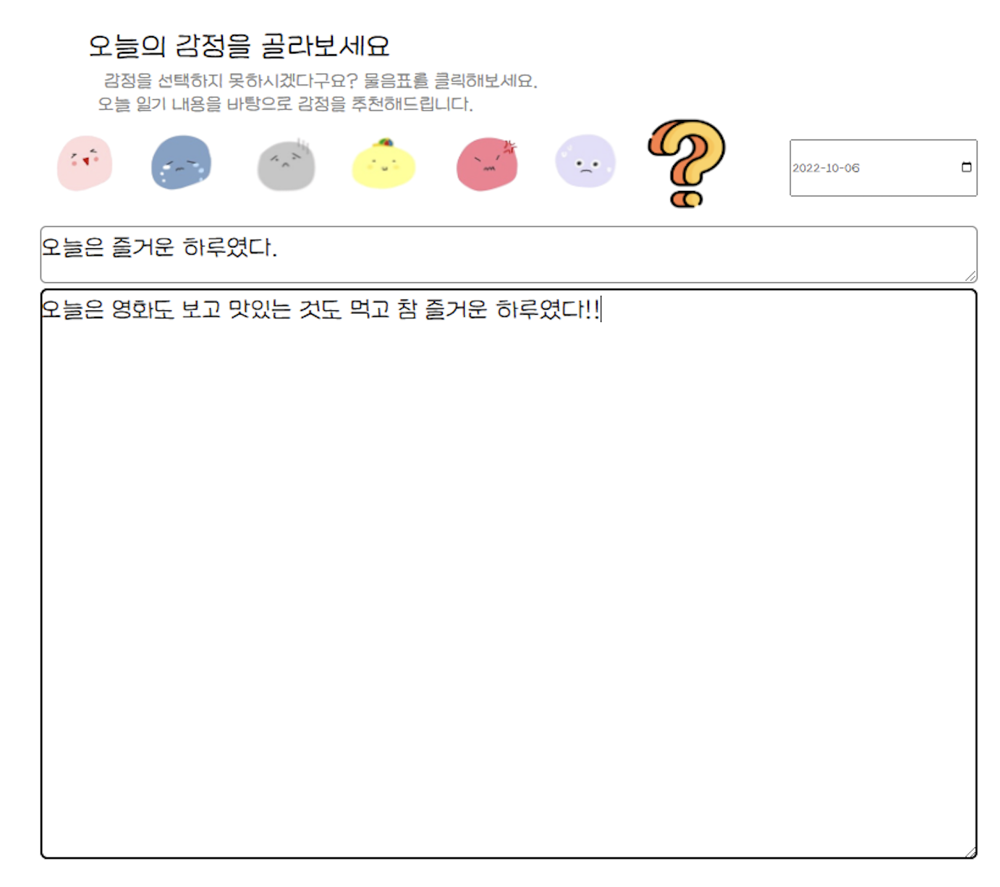
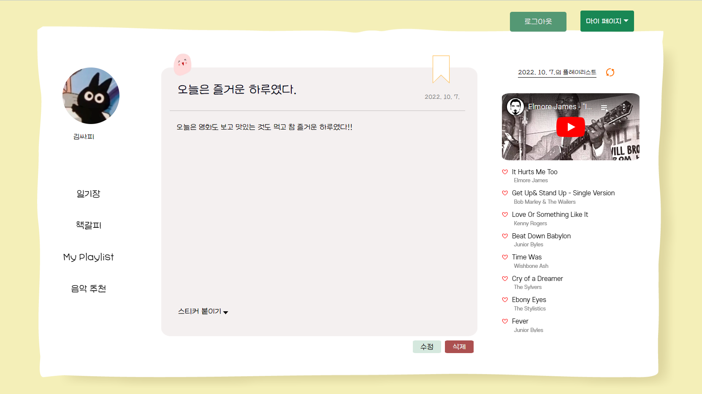
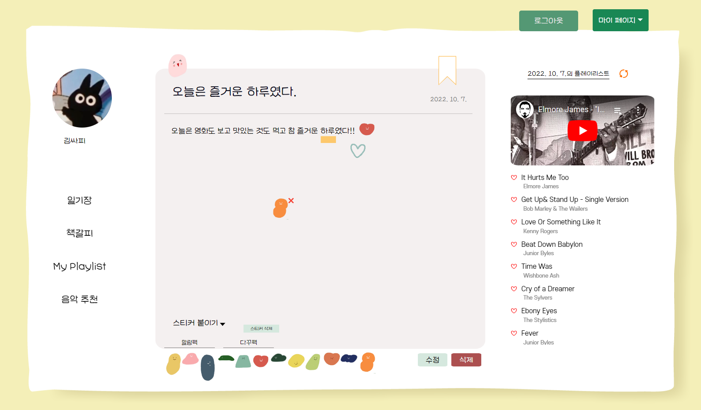
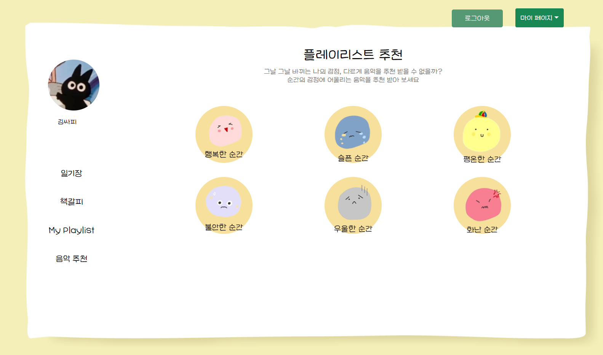
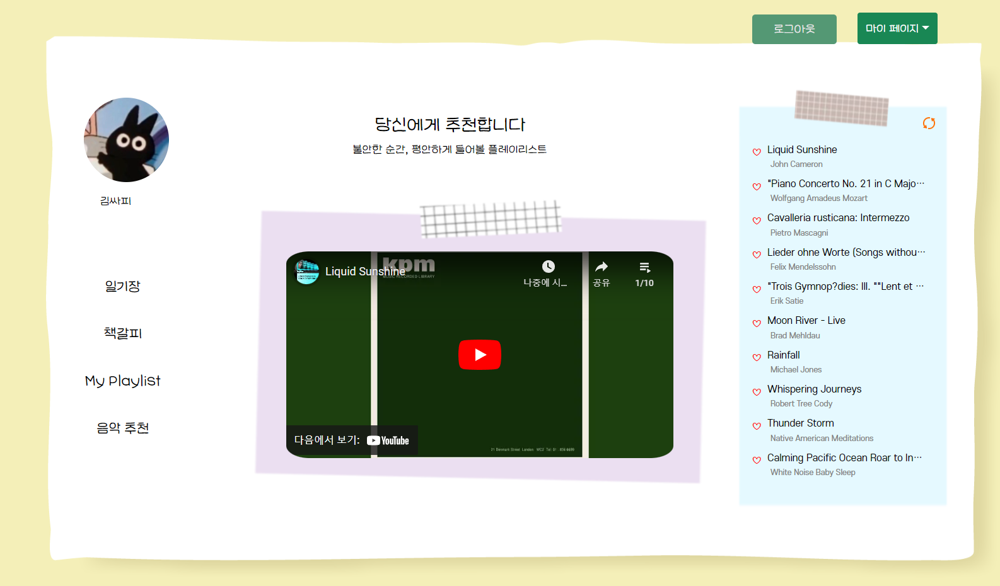
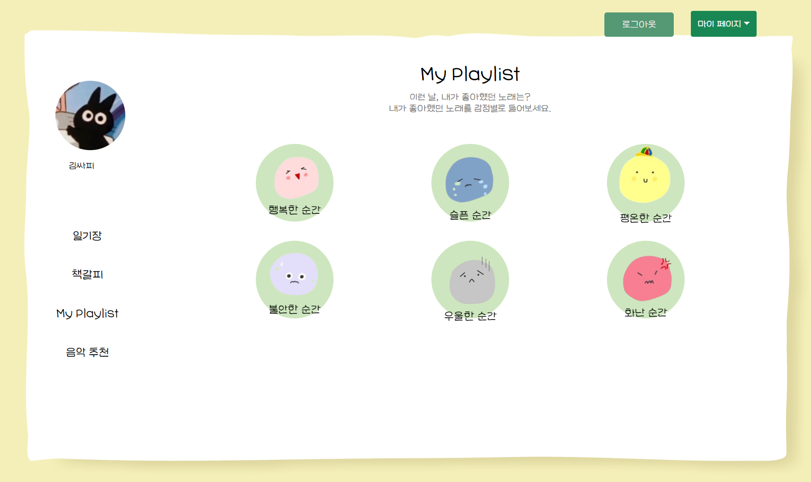
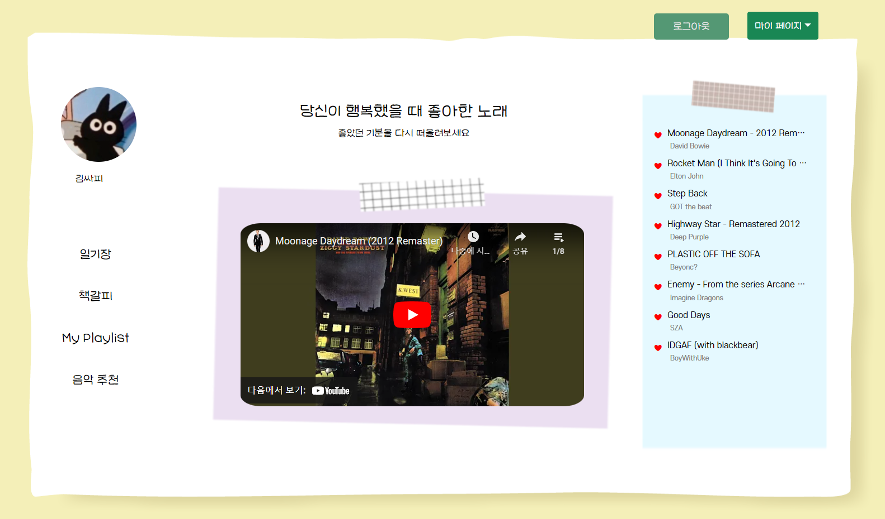
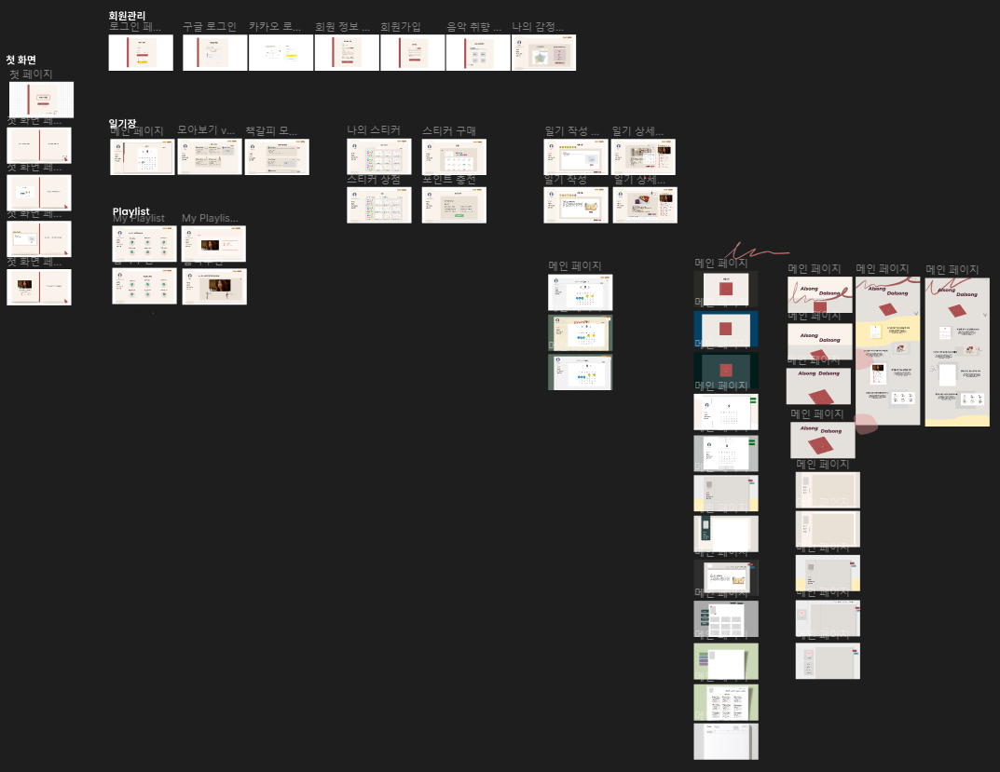
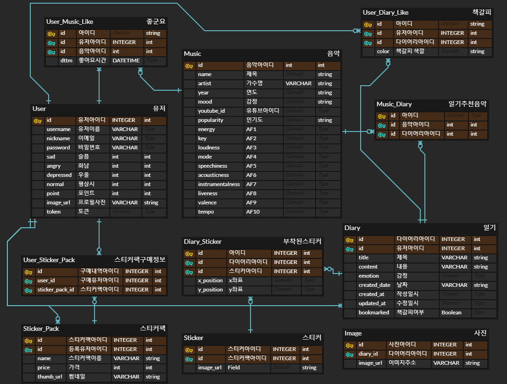
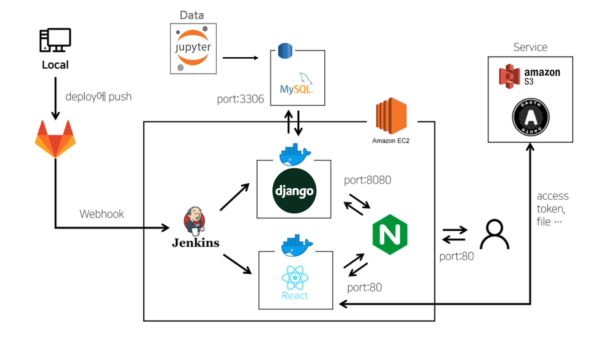

# 📗 Alsong Dalsong : 일기를 쓰면, 노래를 추천해드려요
### 빅데이터 추천 프로젝트

   
  
   

## :pushpin: 목차

- [프로젝트 소개](#프로젝트-소개)
- [프로젝트 상세](#프로젝트-상세)
- [프로젝트 설계](#프로젝트-설계)
- [기술스택](#기술스택)
- [개발 기간](#개발-기간)
- [팀원 소개](#팀원-소개)

 

# 프로젝트 소개

## 소개

> 사람들은 하루의 마무리를 하면서 일기를 쓰게 됩니다. 어떤 날은 날아갈 것처럼 기분 좋은 날, 또 다른 날은 발걸음도 무거운 우울한 날일 수 있습니다. 기존의 서비스들은 일기만을 기록하지만, 저희는 여기에 그날의 기분에 맞는 음악을 들려주고자 합니다. 그렇게 해서 하루에 대한 기억이 더 다채로워지게 만들고자 이 서비스를 기획했습니다.

## 목표

사용자는 자신의 취향을 바탕으로 그 날의 기분에 적합한 노래를 추천 받을 수 있습니다.

# 프로젝트 상세

1. 일기 작성

 

 

2. 스티커

 

3. 음악 추천

 

 

 

 

[UCC]()

 

# 프로젝트 설계

## 와이어프레임

## ERD

## 시스템 아키텍처

## API 명세서

 

# 기술스택

## FE

|  |  |  |  |  |
|:-:|:-:|:-:|:-:|:-:|
|HTML|CSS|Javascript|React|Redux|

|  |  | | |
|:-:|:-:|:-:|:-:|
|Sass|React-Bootstrap|moment.js|styled-components|

## BE

|  |  |  |  |
|:-:|:-:|:-:|:-:|
|Python|Django|DRF|Swagger|

|  | |
|:-:|:-:|
|Oauth2|AWS S3|

## DATA

|  |  |  |
|:-:|:-:|:-:|
|Python|Django|Jupyter|

## CI/CD
||||
|:-:|:-:|:-:|:-:|
|AWS EC2|Jenkins|Docker|Nginx|

 

# 개발 기간
### 22.08.22 ~ 22.10.07

 

## 💝 팀원 소개

<table>
    <tr>
        <td height="140px" align="center"> <a href="https://github.com/pjuju">
                박주현  (Data / Back-End) </a>  </td>
        <td height="140px" align="center"> <a href="https://github.com/KHyoseon">
                김효선  (Back-End) </a>  </td> 
        <td height="140px" align="center"> <a href="https://github.com/sskong777">
                홍석현  (Back-End) </a>  </td>
        <td height="140px" align="center"> <a href="https://github.com/MilanoBeer">
                신혜연  (Front-End) </a>  </td>
        <td height="140px" align="center"> <a href="https://github.com/jotreee">
                조경수  (Data / Front-End) </a>  </td> 
        <td height="140px" align="center"> <a href="https://github.com/sojung13">
                박소정  (Font-End) </a>  </td>
    </tr>
</table>

